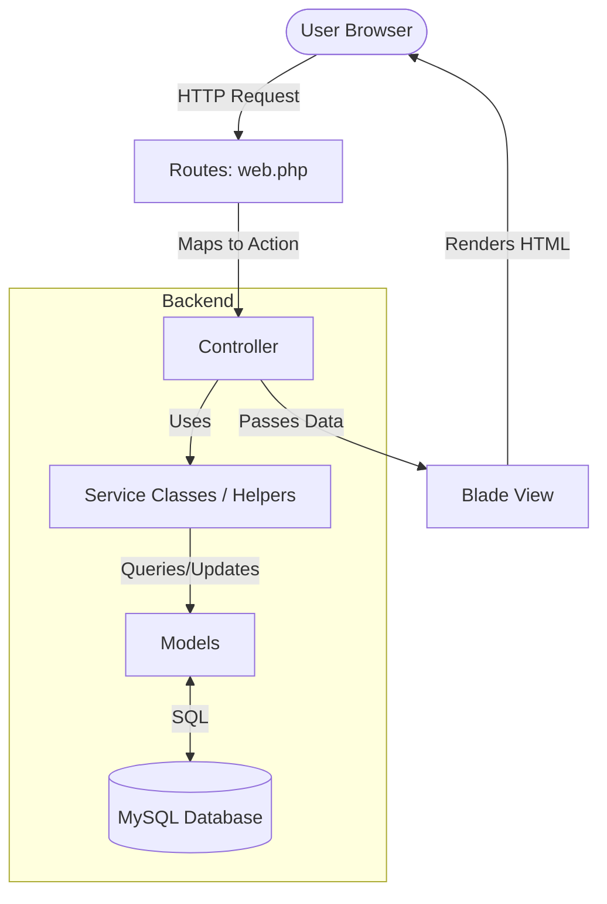

fine

## About Fine

Fine (recursive acronym for "Fine Is Not an Erp") is an open source finance management tool under development. The project serves the purpose of fulfilling a prototype class assignment on the brazilian university "Universidade Positivo".
The main proposition is to offer an interactive pricing interface that helps inexperienced entrepreneurs negotiate with suppliers and find a adequate final price for their products, specially in the reselling of goods through e-commerce.
The first stage of the project consists on building a tool capable of completely replacing an ERP in Brazil, following brazilian laws, conventions and business rules.
The second stage of the project consists on it's abstraction to be fully customizable and deployable in any country.

## About Laravel

Laravel is a web application framework with expressive, elegant syntax, taking the pain out of development by easing common tasks used in many web projects, such as:

- [Simple, fast routing engine](https://laravel.com/docs/routing).
- [Powerful dependency injection container](https://laravel.com/docs/container).
- Multiple back-ends for [session](https://laravel.com/docs/session) and [cache](https://laravel.com/docs/cache) storage.
- Expressive, intuitive [database ORM](https://laravel.com/docs/eloquent).
- Database agnostic [schema migrations](https://laravel.com/docs/migrations).
- [Robust background job processing](https://laravel.com/docs/queues).
- [Real-time event broadcasting](https://laravel.com/docs/broadcasting).

## Assets

The project currently doesn't have image or video assets, relying solely on stylesheets and scripts to conjure up it's visual appearance. Once we are ready to implement asset files, this section will be used to register information about where the assets are stored and how they are synced between development environments.

## Structure

The project follows the [MVC Pattern](https://developer.mozilla.org/en-US/docs/Glossary/MVC), as it's implemented by the [Laravel Framework](https://laravel.com/docs).
Our stack includes the Laravel Blade as the frontend renderer, PHP as the backend language, MySQL as the database engine and NGINX as the proxy server.
Database tables are represented as models at `app/Models/`, while the backend logic can be defined inside of service classes a `app/Services/` and organized by the controllers at `app/Http/Controllers/`. The frontend views are written in `blade.php` files at `resource/views/` and everything is routed with rules defined at `routes/web.php`.

The laravel structure can be resumed in the follow diagram:

## Getting started

For this guide, we'll assume you are using Ubuntu 24. Please, make the necessary adjustments for your operational system.

1. Clone the repository.
2. Configure NGINX on your local machine.
3. Make sure you have php8.3, with all of the essential utilities, installed.
4. Make sure you have npm 10.9 or a newer version.
5. Configure the project directory permissions:
- create a `www-data` group, with your user and nginx's user;
- change ownership recursively (`chown -R`) of the project directory for your user on the group;
- set 775 perms (`chmod`) to all directories, recursivelly;
- set 644 perms (`chmod`) to all files, recursivelly;
- ensure `storage/` and `bootstrap/cache` remain under the `www-data` group with `chmod g+s`.
6. Navigate to the project root directory and run `composer install`, `npm install` and `npm run build`.

## Making changes to the project

Once again, the steps have Ubuntu 24 in mind and require adjustments for your specific operational system.

1. Switch to the `dev` branch, pull changes and create a new `feature/feature-name` or `fix/fix-name` branch.
2. Perform changes, push to origin and open a Pull Request into `dev`:
- describe on the PR if new assets (such as image files) were used, providing the files and the relative path of each one of them in the local project;
